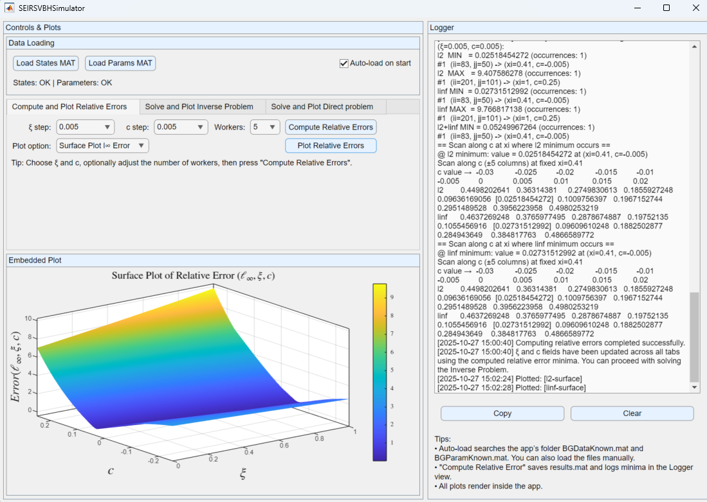
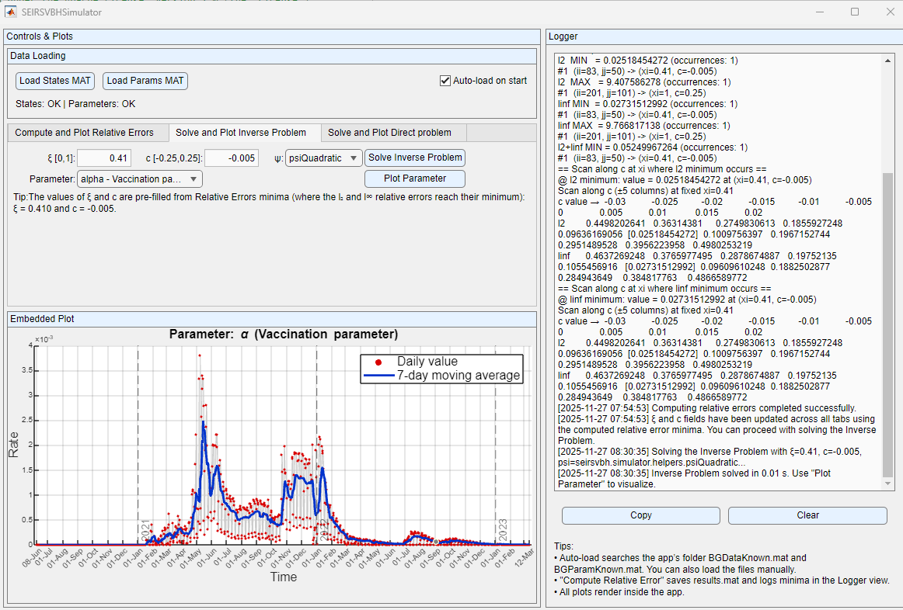
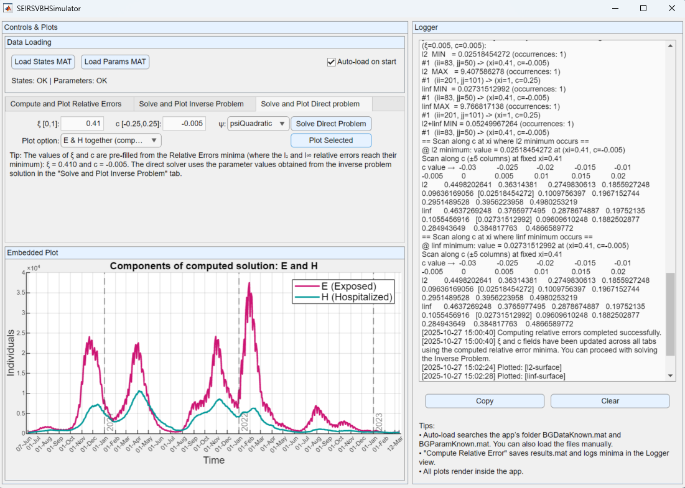

# SEIRSVBH Simulator

## :books: **This repository accompanies the following article:**  

Margenov, S.; Popivanov, N.; Hristov, T.; Koleva, V. Inverse Problem for an Extended Time-Dependent SEIRS Model: Validation with Real-World COVID-19 Data. Mathematics 2026, 14, 13. https://doi.org/10.3390/math14010013


[](https://doi.org/10.3390/math14010013)
[](https://doi.org/10.5281/zenodo.17715034)


## Overview

The SEIRSVBH Simulator is a MATLAB-based tool consisting of **driver scripts** and an **Interactive app** **(GUI)** for parameter estimation and forward simulation of the **SEIRS-VBH model**, as detailed in the aforementioned accompanying article.

This tool reproduces the results from the accompanying article and allows users to explore additional scenarios, estimate parameters, and simulate disease dynamics under various conditions.

## Key Features
As detailed in the accompanying article: 
- Computes and plot the **$l_2$** and **$l_\infty$** relative errors;
- Solves the **Inverse Problem** and **Direct Problem**;
- Plots the estimated parameters and compare model simulations with reported data;
- Computes the **$l_2$** and **$l_\infty$** relative errors for a reference standard SEIR model;
- Supports parallelized computation using MATLAB's Parallel Computing Toolbox for efficient concurrent simulations.


## Components
- **Scripts:** `+seirsvbh/+simulator/+main/`  
- **GUI:** `+seirsvbh/+simulator/+ui/SEIRSVBHSimulator`  
  
  > **Note:** All experiments, figures, and tables in the accompanying article were produced with the MATLAB scripts in  +seirsvbh/+simulator/+main/. The GUI provides the same computations for interactive exploration, but was not used to generate the paper’s results.
---

## Repository structure

```text
SEIRSVBH_Simulator/
└── +seirsvbh/
    └── +simulator/
        │
        ├── +ui/                   
        │   └── SEIRSVBHSimulator.m   → MATLAB App (GUI)
        │
        ├── +main/                 → Driver scripts
        │   ├── runRelativeErrorsDriver.m
        │   ├── runIDPandDirectDriver.m
        │   └── runSeirRefenceDriver.m
        │
        ├── +helpers/              → Utility helper functions
        │   ├── loadReportedData.m
        │   ├── checkInputParams.m
        │   ├── checkH.m
        │   ├── psiQuadratic.m
        │   └── styleDateAxisHelper.m
        │
        ├── +functions/            → Core functions
        │   ├── summarizeRelativeErrorsFromMat.m
        │   ├── saveRelativeErrors.m
        │   ├── plotRelativeErrorsFromMatFile.m
        │   ├── plotModelVsReported.m
        │   ├── plotIDPSolution.m
        │   ├── IDPSolver.m
        │   ├── directProblemSolver.m
        │   ├── computeRelativeErrorsParallel.m
        │   ├── computeRelativeErrorsAt.m
        │   ├── cauchyProblemSolver.m
        │   ├── IDPSolverSeir.m
        │   ├── cauchyProblemSolverSeir.m
        │   └── computeRelativeErrorsAtSeir.m
        │
        ├── +data/                 → Model input and parameter files
        │   ├── BGDataKnownFinal.mat
        │   └── BGParamKnown.mat
        │
        ├── +assets/               → GUI screenshots used in README documentation
        │   ├── dirProblemTab.png
        │   ├── inverseProblemTab.png
        │   └── relErrTab.png
        │
        ├── +licenses/
        │   ├── LICENSE-Code       → Software license governing all source code in the repository
        │   └── LICENSE-Data       → License governing the use, distribution, and citation of included datasets
        │
        ├── CITATION.cff           → Citation file containing the recommended reference for this repository
        ├── NOTICE.md              → Licensing and attributon notice
        ├── README.md              → Main documentation and usage instructions for the repository
        ├── .gitignore             → Git configuration file specifying which files/folders to exclude from version control
        └── results.mat            → Output generated by scripts/app

```
##  Data files
The data files contain officially reported COVID-19 data for Bulgaria over the time period **07 June 2020 – 12 March 2023**. 

| File | Required variables |
|------|--------------------|
| **BGDataKnownFinal.mat** | `A, H, Rtotal, Vtotal, Dtotal, Htotal, I1, N1, R1, V1, B1` |
| **BGParamKnown.mat** | `Lambda, theta, omega, lambda, nu, mu, phi` |


##  Requirements

- MATLAB R2024a or newer  
- Parallel Computing Toolbox (for multi-worker sweeps)  
- Add the `SEIRSVBH_Simulator` folder to the path.

---

##  How to use
###  Using the scripts:

To reproduce the results presented in the accompanying article, two main MATLAB driver scripts are provided.  
Run both in the MATLAB **Command Window** (from the project root directory) **in the sequence shown below**:

**1. runRelativeErrorsDriver**

This script performs the following steps:
- Loads reported data BGDataKnownFinal.mat and BGParamKnown.mat;
- Computes relative errors (`computeRelativeErrorsParallel`) for grids of step size $\xi$ =0.005, $c$ = 0.005, Workers = 10;
> **Note:** The maxWorkers parameter in (computeRelativeErrorsParallel) controls the maxium number of parallel workers. 
The default value is 10, but you can increase or decrease it depending on your system’s CPU capacity. 
In case you set too many workers, the script automatically limits the number to the maximum available on your machine. In case pool initialization fails, the script falls back to serial processing. 
- Saves `results.mat`;
- Summarizes minima in MATLAB console (`summarizeRelativeErrorsFromMat`);
- Generates the contour and surface plots (`plotRelativeErrorsFromMatFile`).

  Run it in the MATLAB **Command Window** as:
  
```matlab
seirsvbh.simulator.main.runRelativeErrorsDriver
```

**2. runIDPandDirectDriver**

This script performs the following steps:
- Loads results.mat and extracts the optimal $$(\xi, c)$$ values corresponding to the minimum relative error;
- Solves the Inverse Problems (`IDPSolver`);
- Plots the time evolution of the estimated parameters (`plotIDPSolution`);
- Solves the direct problem (`directProblemSolver`);
- Plots computed model results vs. officially reported data (`plotModelVsReported`).

Run it in the MATLAB **Command Window** as:

```matlab
seirsvbh.simulator.main.runIDPandDirectDriver
```

**3. runSeirReferencetDriver**
This script performs the following steps:
- Loads reported data BGDataKnownFinal.mat and BGParamKnown.mat;
- Solves the inverse problem for a standard SEIR model (`IDPSolverSeir`);
- Computes and prints the relative errors (`computeRelativeErrorsAt`) for the reference SEIR model; 

Run it in the MATLAB **Command Window** as:

```matlab
seirsvbh.simulator.main.runSeirReferenceDriver
```

###  Using the GUI (For interactive explorations):

The interactive app is organized into several functional tabs, each corresponding to a specific analytical stage:

####  **Compute and Plot Relative Errors** tab:
Users can compute and visualize the **$l_2$** and **$l_\infty$** relative errors between modeled and reported data across the **$(\xi, c)$** parameter space. 

<p align = "center">
  
</p>
<p align = "center">
    <em>Figure 1: Relative Errors computation and visualization.</em>
</p>

To compute the **$l_2$** and **$l_\infty$** relative errors and visualize the results, follow this

 - **Procedure**
1. Choose  $\xi$ and $c$ steps. Optionally, adjust the number of workers for parallel processing.
   > **Note:** The optimal number of workers depends on your system’s hardware (available CPU cores and memory). The script detects the number of CPU cores on the system. 
If you specify more workers than available, the actual number of workers used is automatically restricted to the hardware limit of your machine.
3. Press "Compute Relative Errros" button.
4. All results are logged into the **Logger** view.
5. Choose a plot option adn press "Plot Relative Errors" button.


####  **Solve and Plot Inverse Problem** tab:

Performs parameter estimation by solving the **inverse problem** for the computed **$(\xi, c)$** pair, where the **$l_2$** and **$l_\infty$** relative errors reach their minimum.  

<p align = "center">
  
</p>
<p align = "center">
    <em>Figure 2: Inverse Problem solution and visualization.</em>
</p>

To solve the inverse problem and visualize the results, follow this

 - **Procedure**
1. Review the pre-filled, non-editable  **$(\xi, c)$**, computed based on the **$\xi$**, **$c$** steps selected in "Compute and Plot Relative Errors" tab. Compare the value with the computed value detailed out in the **Logger** view.
2. Press "Solve Inverse Problem button".  
4. The resulting parameters include:
  - **$\alpha$** - Vaccination parameter  
  - **$\beta$** - Transmission rate  
  - **$\gamma$** - Recovery rate of non-hospitalized individuals  
  - **$\rho$** - Hospitalization rate  
  - **$\sigma$** - Recovery rate of hospitalized individuals  
  - **$\tau$** - Mortality rate of infectious people
5. Choose a plot option and press "Plot Parameter" button.


####  **Solve and Plot Inverse Problem** tab:

Solves the **direct SEIRS-VBH model** forward in time using the parameters obtained from the inverse problem.  
This enables direct comparison between model outputs (**$A$**, **$V_{\text{total}}$**, **$R_{\text{total}}$**, **$D_{\text{total}}$**, **$H_{\text{total}}$**)  and the reported epidemiological data over the period **07 June 2020 – 12 March 2023**.

<p align = "center">
  
</p>
<p align = "center">
    <em>Figure 3: Direct Problem solution and visualization.</em>
</p>

To solve the direct problem and visualize the results, follow this

 - **Procedure**
1. Review the pre-filled, non-editable  **$(\xi, c)$**, computed based on the **$\xi$**, **$c$** steps selected in "Compute and Plot Relative Errors" tab. Compare the value with the computed value detailed out in the **Logger** view.
2. Choose a plot option and press "Plot Selected" button.


##  Logging

- All actions, summary of relative errors timestamped in the **Logger** panel  
- `Copy` / `Clear` buttons manage log contents  


##  Citation

If you use this software, please cite both the associated paper and the repository:

Margenov, S.; Popivanov, N.; Hristov, T.; Koleva, V. Inverse Problem for an Extended Time-Dependent SEIRS Model: Validation with Real-World COVID-19 Data. Mathematics 2026, 14, 13. https://doi.org/10.3390/math14010013

For details, see  [`CITATION.cff`](./CITATION.cff).


## License

This repository contains both source code and research materials.
Different licenses apply to different components:
- Code in +seirsvbh/+simulator (in /+ui, /+main, /+helpers, /+functions ) licensed under the **Apache License 2.0** See [`LICENSE`](./+seirsvbh/+simulator/+licenses/LICENSE-Code)  
- Data and Visualizations (in /+data, /+assets or produced by this software) is licensed under the **Creative Commons Attribution 4.0 International License (CC-BY 4.0)**. See [`LICENSE`](./+seirsvbh/+simulator/+licenses/LICENSE-Data) and attribution notices in [`NOTICE`](./NOTICE.md).


## Disclaimer

The materials contained in or produced by this repository are provided “as is”, without warranty of any kind, express or implied.
The authors and their institutions are not liable for any damages or losses resulting from the use of this code or data.


## Authors

**Veneta Koleva**  
Affiliation: Faculty of Mathematics and Informatics, Sofia University 'St. Kliment Ohridski'  
Email: v.koleva@fmi.uni-sofia.bg  
ORCID: https://orcid.org/0000-0001-6019-7106 

**Tsvetan Hristov**  
Affiliation: Faculty of Mathematics and Informatics, Sofia University 'St. Kliment Ohridski'  
Email: tsvetan@fmi.uni-sofia.bg  
ORCID: https://orcid.org/0000-0002-6417-1816  


*Last updated - December 2025.*
